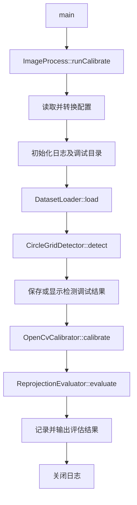
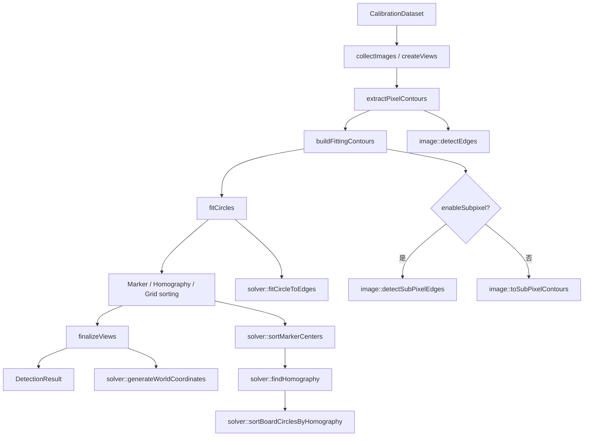
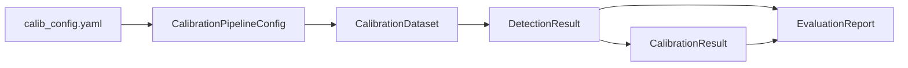

# CamCalib 函数调用关系与 Pipeline 说明

本文档依据当前项目源码整理，描述程序入口、主要函数调用关系、各阶段输入输出以及尚未接入主流程的模块。

## 1. 总体结构

当前程序采用两级 Pipeline：

1. `ImageProcess::runCalibrate()` 负责应用级标定流程。
2. `CircleGridDetector::detect()` 负责圆形标定板检测子流程。



这种职责划分下，`runCalibrate()` 只编排“加载、检测、标定、评估”等高层阶段；边缘检测、圆拟合和圆点排序等算法细节保留在 `CircleGridDetector` 内部。

## 2. 程序入口与主 Pipeline

入口文件：`app/main.cpp`

```text
main()
└── ImageProcess::runCalibrate()
```

`ImageProcess::runCalibrate()` 位于 `src/imageProcess/ImageProcess.cpp`，当前调用顺序如下。

### 2.1 配置阶段

```text
ConfigReader::readConfig("config/calib_config.yaml", CalibrationPipelineConfig&)
├── 使用 cv::FileStorage 读取 YAML
├── 直接填充分组的 CalibrationPipelineConfig
└── 校验数据集、标定板和检测参数
```

主要配置分组：

| 配置结构 | 用途 |
| --- | --- |
| `DatasetConfig` | 图像目录、扩展名及读取模式 |
| `BoardConfig` | 标定板行数、列数、圆心间距 |
| `DetectorConfig` | 轮廓过滤、Marker、排序及亚像素参数 |
| `DebugConfig` | 调试图片保存、窗口显示和输出目录 |
| `LoggingConfig` | 日志开关及输出文件 |
| `CalibrationPipelineConfig` | 聚合数据集、标定板、检测、日志和调试配置 |

### 2.2 日志与调试目录

```text
utils::initializeLogger(LoggingConfig)
utils::prepareDebugOutputDirectory(debugRoot)  [debug.saveImages == true]
```

如果调试目录创建失败，主流程记录错误、关闭日志并直接返回。

### 2.3 数据集加载

```text
DatasetLoader::load()
├── ConfigReader::getImageFiles(imageDirectory, imageExtensions)
│   ├── 遍历目录
│   ├── 按扩展名过滤
│   └── 按文件名自然顺序排序
├── cv::imread(path, readFlag)
├── 跳过读取失败的图像
├── 记录第一张有效图像的尺寸
└── 跳过尺寸不一致的图像
```

输出为 `CalibrationDataset`：

```text
CalibrationDataset
├── images[]
│   ├── path
│   └── image (cv::Mat)
└── imageSize
```

没有加载到有效图像时，主流程终止。

### 2.4 圆点检测

```text
CircleGridDetector detector(pipelineConfig.board, pipelineConfig.detector)
└── detector.detect(dataset) -> DetectionResult
```

完整检测子流程见第 3 节。

### 2.5 检测调试输出和日志

```text
utils::saveDetectionDebugResults(debugRoot, dataset, detection)
    [debug.saveImages == true]

utils::showDetectionDebugResults(dataset, detection)
    [debug.enabled == true && debug.showWindows == true]
```

每张图像的 `ViewObservation` 随后被检查：

- `valid == true`：记录检测点数及 `detectionScore`。
- `valid == false`：记录 `failureReason`。

调试输出按图像建立 `image_NNN` 目录，可能包含：

| 文件 | 内容 |
| --- | --- |
| `00_pixel_edges.txt` | 整像素轮廓点 |
| `01_subpixel_edges.txt` | 浮点轮廓点 |
| `02_detected_edges.png` | 边缘与拟合圆心 |
| `03_fitted_centers.png` | 所有拟合圆 |
| `04_sorted_markers.png` | 排序后的 Marker 圆 |
| `05_sorted_board.png` | 排序后的全部标定板圆点 |

### 2.6 相机标定

```text
OpenCvCalibrator::calibrate(dataset, detection)
├── 遍历 detection.views
├── 跳过 view.valid == false 的视图
├── 收集 objectPoints
├── 将 imagePoints 从 Point2d 转为 Point2f
└── cv::calibrateCamera(...)
```

输出为 `CalibrationResult`，主要包括：

- `cameraMatrix`：相机内参矩阵。
- `distCoeffs`：畸变参数。
- `rotationVectors`、`translationVectors`：每个有效视图的外参。
- `globalRmse`：OpenCV 标定返回的全局 RMS。
- `converged`：内参和畸变结果是否非空。

如果没有有效观测，或标定没有得到结果，`converged` 保持 `false`，主流程终止。

### 2.7 重投影评估

```text
ReprojectionEvaluator::evaluate(detection, calibration)
├── 遍历有效 ViewObservation
├── cv::projectPoints(...)
├── 计算每个点的重投影误差
├── 汇总每张图的 RMSE、最大误差和平均误差向量
├── 汇总 meanViewRmse 和 maxViewRmse
└── 标记 RMSE > globalRmse * 1.5 的疑似离群视图
```

`runCalibrate()` 当前会把每张有效图像的重投影 RMSE 写入日志并输出到控制台。

## 3. 圆形标定板检测子 Pipeline

入口：`CircleGridDetector::detect(const CalibrationDataset&)`



### 3.1 `collectImages()` 与 `createViews()`

职责：从数据集中提取图像数组，并为每张图像建立一个初始 `ViewObservation`。

```text
输入：CalibrationDataset
输出：vector<cv::Mat>
更新：DetectionResult::views
```

每个视图此时只设置 `imagePath` 和 `imageSize`，默认仍为无效视图。

### 3.2 `extractPixelContours()` 与 `buildFittingContours()`

职责：获得候选圆轮廓，并统一生成 `Point2d` 类型的轮廓点。

第一步调用：

```text
image::detectEdges(images, DetectorConfig)
├── buildBinaryImage(image)
│   ├── buildGrayImage(image)
│   └── cv::threshold(..., THRESH_BINARY_INV | THRESH_OTSU)
├── cv::findContours(..., RETR_EXTERNAL, CHAIN_APPROX_NONE)
└── filterCircularContours(...)
    ├── 按 minContourPoints 过滤
    └── 按包围盒长短轴比 maxAxisRatio 过滤
```

结果写入 `DetectionResult::pixelEdges`，点类型为 `cv::Point`，即整数像素坐标。

第二步根据配置分支：

```text
enableSubpixel == true
└── image::detectSubPixelEdges()
    └── refineEdgesToSubPixel(images, pixelEdges, 9x9 kernel)

enableSubpixel == false
└── image::toSubPixelContours()
    └── 仅将 cv::Point(x, y) 转为 cv::Point2d(x, y)
```

`toSubPixelContours()` 不会提高坐标精度，只负责把后续圆拟合的输入统一为 `cv::Point2d`。

结果写入 `DetectionResult::subPixelEdges`。

### 3.3 `fitCircles()`

职责：对每个候选轮廓拟合圆，并生成初步检测评分。

```text
每张图像
└── 每条轮廓
    └── solver::fitCircleToEdges(contour)
        ├── 构造线性方程 A * params = b
        ├── 使用 Eigen::JacobiSVD 求伪逆
        └── 得到 Circle.center 与 Circle.radius
```

轮廓点少于 3 个时，返回半径为零的圆。

当前检测评分为：

```text
detectionScore = 拟合圆数量 / (board.rows * board.cols)
```

没有拟合到圆时设置：

```text
failureReason = "No circular contours were fitted."
```

结果写入 `DetectionResult::fittedCircles`。

### 3.4 Marker、单应矩阵与网格排序

职责：识别定位 Marker，计算单应矩阵，并把全部圆点排成标定板顺序。

#### 3.4.1 `solver::sortMarkerCenters()`

```text
sortMarkerCenters()
├── getBigMarkers()
│   └── 按半径降序取前 markerCount 个圆
├── findNearestAndFarthestMarkers()
├── findRemainingMarkerIndex()
├── isMarkerPairParallel()
└── orderBigMarkers()
```

当前算法明确要求 `markerCount == 5`。Marker 数量不足、几何关系不满足时，该图像返回空的 Marker 数组。

结果写入 `DetectionResult::sortedMarkerCircles`。

#### 3.4.2 `solver::findHomography()`

使用排序后的 5 个 Marker 图像坐标及预定义的理想平面坐标构造 DLT 方程，通过 Eigen SVD 得到 `3 x 3` 单应矩阵。

结果写入 `DetectionResult::homographies`。

#### 3.4.3 `solver::sortBoardCirclesByHomography()`

```text
图像圆心
└── inverseHomography * imagePoint
    └── 得到近似标定板坐标 board_row / board_col
        └── 先按行、再按列排序
```

`rowTolerance` 用于判断两个点是否属于不同的行。

结果写入 `DetectionResult::sortedBoardCircles`。

### 3.5 `finalizeViews()`

职责：验证每张图像的检测结果，并组装标定所需的二维点和三维点。

```text
toObjectPoints(BoardConfig)
└── solver::generateWorldCoordinates(1, rows, cols, spacingMm)
```

每个视图依次检查：

1. Marker 排序结果是否存在。
2. 标定板圆点排序结果是否存在。
3. 排序后的圆点数量是否等于 `rows * cols`。

全部通过后：

```text
sortedBoardCircles
├── toImagePoints() -> view.imagePoints
├── toObjectPoints() -> view.objectPoints
├── view.valid = true
└── 清空 failureReason
```

## 4. Pipeline 中的数据流



### 4.1 `DetectionResult` 的逐阶段填充

| 阶段 | 填充字段 |
| --- | --- |
| `collectImages()` / `createViews()` | `views`，并生成检测使用的图像数组 |
| `extractPixelContours()` / `buildFittingContours()` | `pixelEdges`、`subPixelEdges` |
| `fitCircles()` | `fittedCircles`、`views[].detectionScore` |
| Detector 中的同层 solver 调用 | `sortedMarkerCircles`、`homographies`、`sortedBoardCircles` |
| `finalizeViews()` | `views[].imagePoints`、`objectPoints`、`valid`、`failureReason` |

### 4.2 三层轮廓容器的含义

以下类型在边缘检测阶段多次出现：

```cpp
std::vector<std::vector<std::vector<cv::Point2d>>>
```

其层级为：

```text
所有图像
└── 一张图像中的所有轮廓
    └── 一条轮廓中的所有点
```

### 4.3 视图索引映射

`DetectionResult` 中的各个外层数组以数据集图像索引对应同一张图。标定时只收集 `view.valid == true` 的视图，因此：

- `detection.views` 的索引是原始数据集索引。
- `CalibrationResult::rotationVectors/translationVectors` 的索引是“有效视图序号”。
- `ReprojectionEvaluator` 使用 `calibrationViewIndex` 单独跟踪该映射。

## 5. 错误与提前退出路径

| 位置 | 条件 | 处理方式 |
| --- | --- | --- |
| `runCalibrate()` | 配置读取失败 | 输出错误并返回 |
| `runCalibrate()` | 调试目录创建失败 | 记录错误、关闭日志并返回 |
| `DatasetLoader::load()` | 单张图读取失败 | 跳过该图 |
| `DatasetLoader::load()` | 单张图尺寸不一致 | 跳过该图 |
| `runCalibrate()` | 数据集为空 | 记录错误、关闭日志并返回 |
| `CircleGridDetector::detect()` | 数据集为空 | 返回空 `DetectionResult` |
| `finalizeViews()` | Marker/圆点排序失败或数量错误 | 将该视图标记为无效并记录原因 |
| `OpenCvCalibrator::calibrate()` | 没有有效视图 | 返回 `converged == false` |
| `runCalibrate()` | 标定未收敛 | 记录错误、关闭日志并返回 |
| `ReprojectionEvaluator::evaluate()` | 标定未收敛 | 返回仅包含默认值的报告 |

## 6. 当前未接入主 Pipeline 的模块

以下代码存在于项目中，但当前 `main()` → `runCalibrate()` 主链没有调用：

| 模块 | 当前状态 |
| --- | --- |
| `CannyDetecter` | 手写 Canny 实现；主检测流程未使用 |
| `image::detectEdgesGradient()` | OpenCV Canny 轮廓分支；主流程当前使用 `detectEdges()` 二值化分支 |
| `image::detectSubPixelEdges_ray()` | 当前只是转调 `toSubPixelContours()`，没有实现注释所述的射线梯度算法 |
| `image::showCannyEdges()` | 独立显示工具；主流程未使用 |
| `utils::collectImagePoints()` | 辅助数据转换；当前标定器直接从 `ViewObservation` 收集点 |
| `utils::calculatePerImageReprojectionErrors()` | 另一套重投影误差工具；当前使用 `ReprojectionEvaluator` |
| `ChessboardDetector` | 头文件和源文件当前没有实现内容 |
| `Camera`、`View` | 当前文件为空 |
| `LieAlgebra`、`Normalization` | 当前文件为空 |
| `CalibCostFunction`、`LM_Optimizer` | 当前文件为空，尚未接入自定义优化流程 |
| `Undistort` | 当前文件为空 |

## 7. 当前调用关系总览

```text
main
└── ImageProcess::runCalibrate
    ├── ConfigReader::readConfig
    ├── utils::initializeLogger
    ├── utils::prepareDebugOutputDirectory                  [可选]
    ├── DatasetLoader::load
    │   ├── ConfigReader::getImageFiles
    │   └── cv::imread
    ├── CircleGridDetector::detect
    │   ├── collectImages
    │   ├── createViews
    │   ├── extractPixelContours
    │   │   ├── image::detectEdges
    │   │   │   ├── buildBinaryImage
    │   │   │   │   └── buildGrayImage
    │   │   │   └── filterCircularContours
    │   ├── buildFittingContours
    │   │   ├── image::detectSubPixelEdges                 [开启亚像素]
    │   │   │   └── refineEdgesToSubPixel
    │   │   └── image::toSubPixelContours                  [关闭亚像素]
    │   ├── fitCircles
    │   │   └── solver::fitCircleToEdges
    │   ├── solver::sortMarkerCenters
    │   │   ├── getBigMarkers
    │   │   ├── findNearestAndFarthestMarkers
    │   │   ├── findRemainingMarkerIndex
    │   │   ├── isMarkerPairParallel
    │   │   └── orderBigMarkers
    │   ├── solver::findHomography
    │   ├── solver::sortBoardCirclesByHomography
    │   └── finalizeViews
    │       ├── toObjectPoints
    │       │   └── solver::generateWorldCoordinates
    │       └── toImagePoints
    ├── utils::saveDetectionDebugResults                    [可选]
    │   ├── saveEdgesToText
    │   ├── renderEdgeAndCircleCenters
    │   ├── renderSortedCircleCenters
    │   └── saveDebugImage
    ├── utils::showDetectionDebugResults                    [可选]
    │   ├── showSortedCircleCenters
    │   └── showWarpedImage
    ├── OpenCvCalibrator::calibrate
    │   └── cv::calibrateCamera
    ├── ReprojectionEvaluator::evaluate
    │   └── cv::projectPoints
    └── utils::shutdownLogger
```

## 8. 维护时的职责边界建议

- `ImageProcess::runCalibrate()`：只负责应用级阶段编排和阶段间错误处理。
- `DatasetLoader`：只负责发现、读取和验证输入图像。
- `CircleGridDetector`：负责从图像得到有序的二维/三维标定观测。
- `EdgeProcessing`：负责像素轮廓和亚像素轮廓处理。
- `solver`：负责圆拟合、Marker 几何关系、单应矩阵和圆点排序。
- `OpenCvCalibrator`：只负责把有效观测送入标定算法并返回参数。
- `ReprojectionEvaluator`：只负责标定结果的误差评估。
- `ResultIO`：只负责检测结果的保存、渲染和显示，不参与检测算法。

增加新检测算法时，优先新增或替换 Detector，而不把算法步骤展开到 `runCalibrate()`；增加新的标定算法时，优先新增 Calibrator，并保持 `DetectionResult` 到 `CalibrationResult` 的阶段边界。
